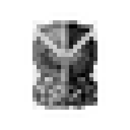
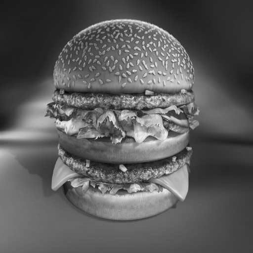
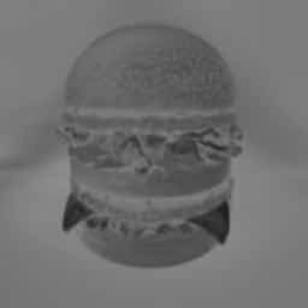
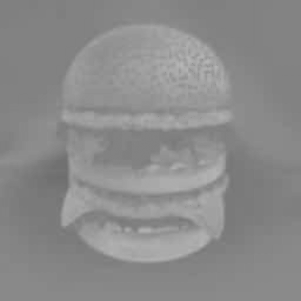
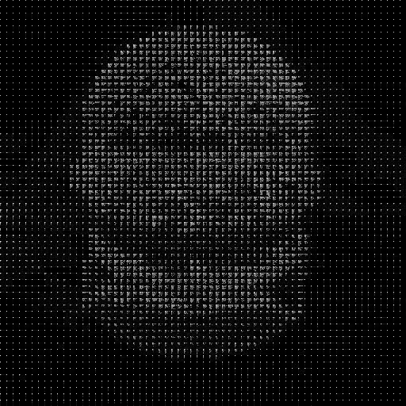
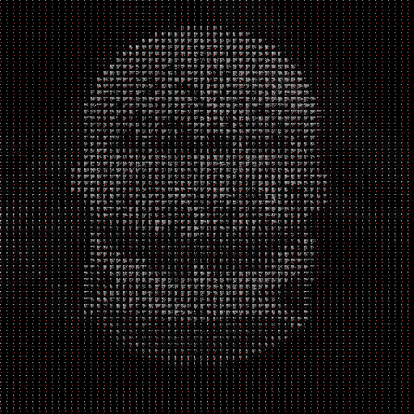
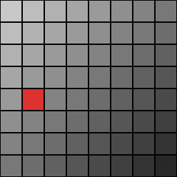
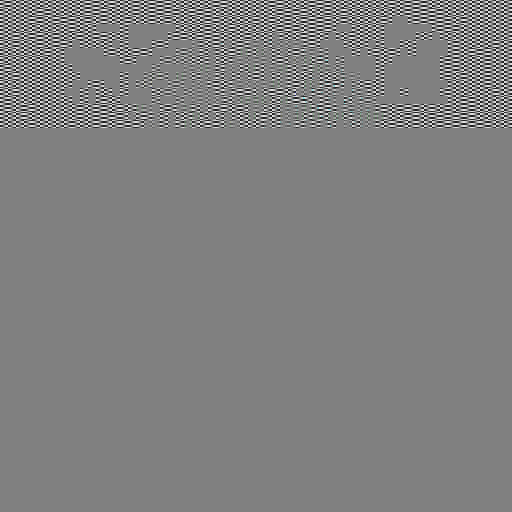
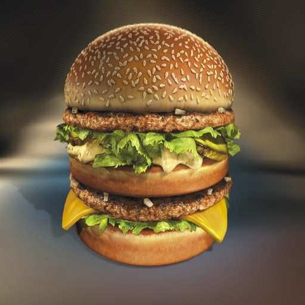

# DCT-Based Image Watermarking

Digital image watermarking menggunakan DCT (Discrete Cosine Transform).
Implementasi pure Python — tanpa numpy, cv2, atau scipy.
Input JPEG, PNG, dan BMP didukung.

---

## Quick Start

```bash
# 1. Install Pillow ( untuk baca/tulis JPEG & PNG)
pip install Pillow

# 2. Pindahkan gambar ke folder assets/ (lihat bagian "Input" di bawah)

# 3. Jalankan pipeline
python main.py
```

Kalau belum punya gambar, jalankan generate assets untuk membuat sample otomatis:

```bash
python generate_assets.py
python main.py
```

---

## Input
### Lokasi File

```
wm/
└── assets/
    ├── host.jpg        < gambar utama (atau host.jpeg / host.png / host.bmp)
    └── watermark.jpg   < gambar watermark (atau watermark.jpeg / watermark.png / watermark.bmp)
```

Program mencari file dalam urutan: `.jpg` → `.jpeg` → `.png` → `.bmp`.
Kalau tidak ada keduanya, sample prosedural dibuat otomatis.

### Host Image

| Properti | Syarat |
|----------|--------|
| Format | `.jpg`, `.jpeg`, `.bmp`, `.png` |
| Ukuran | Bebas, tapi **rekomendasi 256×256 atau 512×512** |
| Minimum | 8×8 piksel (satu blok DCT) |
| Mode | RGB (grayscale akan di-convert otomatis) |

### Watermark Image

| Properti | Syarat |
|----------|--------|
| Format | `.jpg`, `.jpeg`, `.bmp`, `.png` |
| Ukuran | **Idealnya 32×32 piksel** |
| Auto-resize | Ukuran lain otomatis di-resize ke 32×32 (dengan peringatan) |
| Konten | Gambar biner/logo/teks — nilai piksel >127 jadi bit 1, ≤127 jadi bit 0 |

> Gunakan gambar hitam-putih tinggi kontras sebagai watermark
> supaya hasil ekstraksi mudah diverifikasi secara visual.

---

## Output

Semua hasil disimpan di folder `output/`:

```
output/
├── watermarked.bmp          ← host + watermark (sebelum kompresi)
├── compressed_QF100.bmp     ← hasil simulasi JPEG QF=100
├── compressed_QF090.bmp
├── ...
├── compressed_QF010.bmp
├── extracted_QF100.bmp      ← watermark yang berhasil diekstrak dari masing-masing QF
├── extracted_QF090.bmp
├── ...
└── results.txt              ← tabel BER, NC, PSNR lengkap
```

---

## Cara Kerja

```
Host Image (JPEG/BMP)
    │
    V  Pillow/native reader
    pixels[row][col] = (R, G, B)
    │
    V  RGB → YCbCr, ambil channel Y
    V  Level shift: Y − 128
    V  Blok 8×8 > DCT 2D
    V  Embed 1 bit watermark per blok
       (kuantisasi paritas di koefisien DCT posisi (4,1))
    V  IDCT > level shift balik > YCbCr > RGB
    │
    V  watermarked.bmp
    │
    V  Untuk QF ∈ {100, 90, 80, 70, 60, 50, 40, 30, 20, 10}:
       DCT → quantize(QF) → dequantize → IDCT  (simulasi JPEG)
       Ekstrak watermark → hitung BER & NC
```

---

## Visualisasi Pipeline

Jalankan `python step_by_step.py` untuk menghasilkan semua gambar berikut di folder `steps/`.

### Tahap 1 — Input

| Host Image | Watermark (diperbesar 8×) |
|:---:|:---:|
|  |  |

### Tahap 2 — Konversi RGB → YCbCr

| Channel Y (Luminance) | Channel Cb | Channel Cr |
|:---:|:---:|:---:|
|  |  |  |

Watermark disisipkan ke **channel Y saja** karena mata manusia lebih sensitif terhadap perubahan luminance, dan channel Y tidak di-subsample oleh JPEG.

### Tahap 3 — Domain DCT

| DCT Spectrum (log-magnitude) | Posisi embed di setiap blok (titik merah = koefisien (4,1)) |
|:---:|:---:|
|  |  |

| Blok aktif (putih) vs tidak aktif (abu) | Diagram satu blok 8×8 (sel merah = titik embed) |
|:---:|:---:|
|  |  |

> **Apa itu titik merah?**
> Setiap blok 8×8 dari channel Y diubah ke domain frekuensi dengan DCT, menghasilkan **64 koefisien** per blok — dari DC (energi rendah, pojok kiri-atas) hingga frekuensi tinggi (pojok kanan-bawah).
> **Titik merah menandai koefisien di baris 4, kolom 1** dalam grid 8×8 itu — posisi *mid-frequency* yang dipilih untuk menyisipkan satu bit watermark.
>
> Watermark 32×32 = **1024 bit** → hanya **1024 blok pertama** (area kiri-atas, kotak putih di gambar `07b`) yang dimodifikasi. Sisa blok tidak disentuh.
> Gambar `07c` memperjelas: dari 64 koefisien dalam satu blok, hanya **satu sel merah** yang diubah nilainya.

### Tahap 4 — Embedding

| Host (asli) | Watermarked | Perbedaan × 20 |
|:---:|:---:|:---:|
|  |  |  |

Gambar watermarked identik secara visual dengan host. Perbedaan diperbesar 20× — **abu-abu = tidak berubah**, terang/gelap = perubahan nilai piksel.

### Tahap 5 — Simulasi Kompresi JPEG

| QF=100 | QF=80 | QF=50 | QF=20 |
|:---:|:---:|:---:|:---:|
|  |  |  |  |

### Tahap 6 — Ekstraksi Watermark

| QF=100 — BER=0.000 ✓ | QF=80 — BER=0.000 ✓ | QF=50 — BER=0.000 ✓ | QF=20 — BER=0.795 ✗ |
|:---:|:---:|:---:|:---:|
|  |  |  |  |

Watermark dapat diekstrak sempurna hingga QF=30. Pada QF=20, kompresi JPEG terlalu agresif — kuantisasi menghancurkan nilai koefisien (4,1) sehingga bit tidak bisa dibaca kembali.

---

## Parameter

| Parameter  | Default | File | Penjelasan |
|------------|---------|------|------------|
| `DELTA`    | `30`    | `src/watermark.py` | Quantization step embedding. Lebih besar > lebih tahan kompresi, PSNR turun |
| `COEF_POS` | `(4, 1)` | `src/watermark.py` | Posisi koefisien DCT middle yang dimodifikasi |
| `QF_LIST`  | `[100..10]` | `main.py` | Daftar Quality Factor JPEG yang diuji |

Untuk mengubah delta, edit baris ini di `src/watermark.py`:

```python
DELTA = 30   # naikkan untuk lebih robust, turunkan untuk PSNR lebih tinggi
```

---

## Contoh Output Tabel

```
Host: 512x512  Watermark: 32x32  Delta: 30
Embed PSNR: 46.52 dB
Clean extraction — BER=0.000, NC=1.000

┌─────┬────────┬───────┬───────┐
│ QF  │  PSNR  │  BER  │  NC   │
├─────┼────────┼───────┼───────┤
│ 100 │  72.33 │ 0.000 │ 1.000 │
│  90 │  57.94 │ 0.000 │ 1.000 │
│  80 │  55.95 │ 0.000 │ 1.000 │
│  70 │  52.30 │ 0.000 │ 1.000 │
│  60 │  48.94 │ 0.001 │ 0.999 │
│  50 │  47.79 │ 0.000 │ 1.000 │
│  40 │  47.30 │ 0.000 │ 1.000 │
│  30 │  45.65 │ 0.000 │ 1.000 │
│  20 │  42.13 │ 0.479 │ 0.000 │
│  10 │  37.98 │ 0.479 │ 0.000 │
└─────┴────────┴───────┴───────┘

Kesimpulan: QF kritis = 20
  Watermark mulai gagal diekstrak pada QF=20
```

---

## Penggunaan Modul Python

### Embed watermark ke gambar JPEG

```python
from src.image_io import read_image, write_image
from src.watermark import load_watermark_bits, embed_watermark

# Baca host (JPEG atau BMP)
host_pixels, w, h = read_image("assets/host.jpg")

# Baca watermark, otomatis resize ke 32×32 jika perlu
wm_bits, wm_w, wm_h = load_watermark_bits("assets/watermark.jpg")

# Embed
watermarked = embed_watermark(host_pixels, w, h, wm_bits, delta=30)

# Simpan (BMP, JPEG, atau PNG)
write_image("output/watermarked.bmp", watermarked, w, h)
```

### Ekstrak watermark dari gambar

```python
from src.image_io import read_image
from src.watermark import extract_watermark
from src.metrics import ber, nc

watermarked_pixels, w, h = read_image("output/watermarked.bmp")

wm_length = 32 * 32  # 1024 bit
extracted_bits = extract_watermark(watermarked_pixels, w, h, wm_length, delta=30)

# Bandingkan dengan watermark asli
original_bits = [...]   # list of 0/1
print(f"BER: {ber(original_bits, extracted_bits):.3f}")
print(f"NC:  {nc(original_bits, extracted_bits):.3f}")
```

### Simulasi efek JPEG compression

```python
from src.image_io import read_image, write_image
from src.jpeg_sim import simulate_jpeg_rgb

pixels, w, h = read_image("output/watermarked.bmp")

# Simulasi QF=50 (lossy)
compressed = simulate_jpeg_rgb(pixels, w, h, qf=50)
write_image("output/compressed_qf50.bmp", compressed, w, h)
```

---

## Metrik Evaluasi

| Metrik | Keterangan | Nilai ideal |
|--------|------------|-------------|
| **PSNR** | Kualitas gambar watermarked vs original | > 40 dB |
| **BER** | Bit error rate watermark hasil ekstraksi | 0.0 (sempurna) |
| **NC** | Normalized correlation | 1.0 (identik) |

Watermark dianggap **gagal** jika BER > 0.25 atau NC < 0.70.

---

## Struktur File

```
wm/
├── assets/               ← taruh host.jpg & watermark.jpg di sini
├── output/               ← hasil otomatis tersimpan di sini
├── src/
│   ├── image_io.py       # unified reader/writer (JPEG + BMP + PNG)
│   ├── bmp_io.py         # native BMP parser
│   ├── color.py          # RGB ↔ YCbCr
│   ├── dct.py            # 2D DCT & IDCT
│   ├── watermark.py      # embed & extract
│   ├── jpeg_sim.py       # simulasi kompresi JPEG
│   ├── metrics.py        # PSNR, BER, NC
│   └── utils.py          # matrix helpers
├── main.py               # pipeline utama
├── generate_assets.py    # buat sample host & watermark prosedural
└── README.md
```

---

## Referensi

- [invisible-watermark](https://github.com/ShieldMnt/invisible-watermark)
- JPEG Standard: ITU-T T.81
